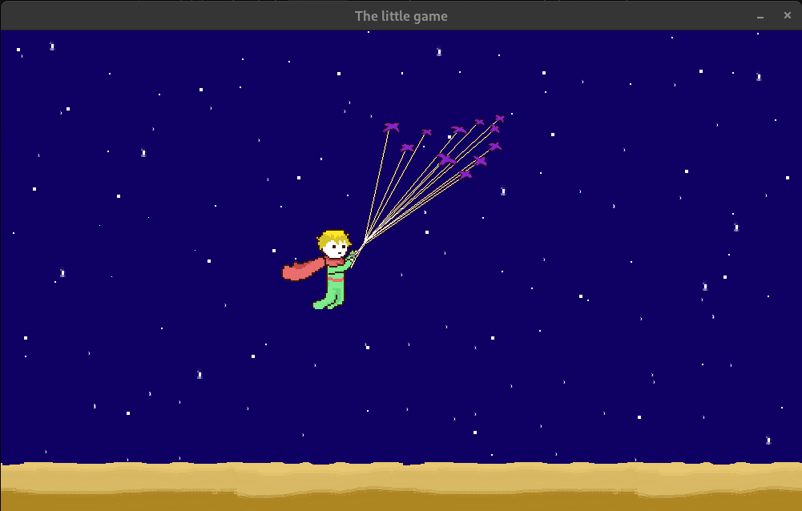

# The Little Game  
*A Pygame 2D game inspired by* **The Little Prince** *by Antoine de Saint-Exupéry*

## Overview
**The Little Game** is a 2D side-scrolling game built in *Python (Pygame)*. You play as *The Little Prince*, who just arrived on the *King's* planet, and must now bring him gold.

The app begins with a menu screen:

and with any key press the game starts.

  
  

## Controls ##
The following keys control the Little Prince 
| Action | Key(s) | Image |
|--------|--------|-------|
| Jump | `W`, `SPACE`, or `↑` |  |
| Move Left | `A` or `←` |  |
| Move Right | `D` or `→` |  |
| Play dialogue | `ENTER` |  |
| Pick up gold | `P` |  |
| Give gold | `G` |  |

## In-game instructions ##
The game provides instructions, either directly or through the King’s dialogue:
| Action | Instruction |
|--------|-------------|
| Game starts - Find the king |  |
| Interact with the King |  |
| Collect gold |  |
| Pick up gold |  |
| Give gold to the King |  |
| Collect more gold |  |

## Game Mechanics  

- **Dialogue System:** Characters communicate through animated on-screen text
- **Collectibles:** Gold items appear randomly; you must collect a number of them to finish the game
- **Animations:** Birds, movement, and idle states are animated using timed Pygame events  
- **Environment:** Parallax scrolling and looping backgrounds enhance depth and continuity

## How to run the game ##
- You must have both Python and Pygame installed
- Run the game with `python ATESTAT.py` in a console; Run the command in the folder containing the project
